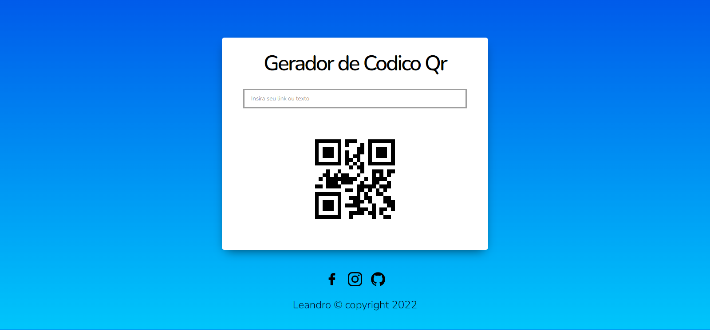

# Gerador-de-Qr-code-js-
Gerador de Qr code simples usando javascript com a biblioteca qrcode,js 

<a style="font-size: 40px;" href="https://woppedwoke.github.io/senha-gerador/">Usar</a>

# Preview

# Tecnologias usadas
<ul>
  <li>HTML</li>
  <li>CSS</li>
  <li>JAVASCRIPT</li>
</ul>

